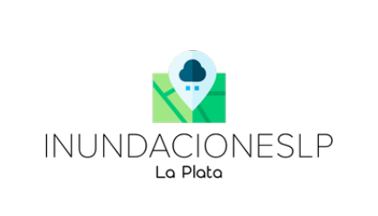

<div align="center">
    
</div>

## Sobre la aplicación 

InundacionesLP es un sistema creado con el fin de gestionar y dar servicios ante eventuales inundaciones en el área de La Plata. El sistema posee una app pública que brinda información necesaria sobre las zonas propensas a inundarse, realizar denuncias y ofrecer lugares de encuentro ante tales situaciones. Por otro lado también posee una app privada que permite gestionar y dar respuesta a estos incidentes.

### Usuarios de la app privada

Para acceder a la aplicación privada desde un usuario admin y/o operador se requieren los siguientes datos:

|email|contraseña|
|--|--|
|luchi@gmail.com|1234|
|mario@gmail.com|1234|
|lucas@gmail.com|1234|

### Denuncias y seguimientos

Para cambiar el estado de una denuncia debe realizarse a través de los seguimientos, sin embargo la denuncia puede tener mas de un seguimiento sin haber cambiado de estado. 
Además las denuncias pueden estar asociadas a un usuario del sistema, por lo tanto los usuarios tendran una pestaña de "Mis Seguimientos" donde podrán ver todas las denuncias asignadas a si mismo. 

### API 

/api/denuncias Retorna el listado de todas las denuncias del sistema sin paginar.
/api/denuncias/nro_pagina Retorna la página en particular con la cantidad configurada en el sistema.
/api/denuncias/nro_pagina/nro_pagina?per_page=nro_elementos Retorna la página en particular con la cantidad de elementos pasada por la url.


### Dependencias
- Lenguaje: Python 3.8.10.
- Servidor Web: Apache 2.4.41.
- Servidor de Base de Datos: MariaDB 10.3.31.
- Librerias:
```
Flask 2.0.1
PyMySQL 1.0.2
Flask-Session 0.4
black 21.9b0
python-dotenv 0.19.0
SQLAlchemy 1.4.25
Flask-SQLAlchemy 2.5.1
Flask-WTF 0.15.1
email-validator 1.1.3
flask-bcrypt 0.7.1
```
## Grupo 22
- Andrea Goyechea (17344/2)
- Echeverria Tomas (17293/9)
- Luciano Zarate (16991/5)
- Diego Aguilar (16868/3)
  
>Los archivos multimedia utilizados son contenido original del proyecto 
